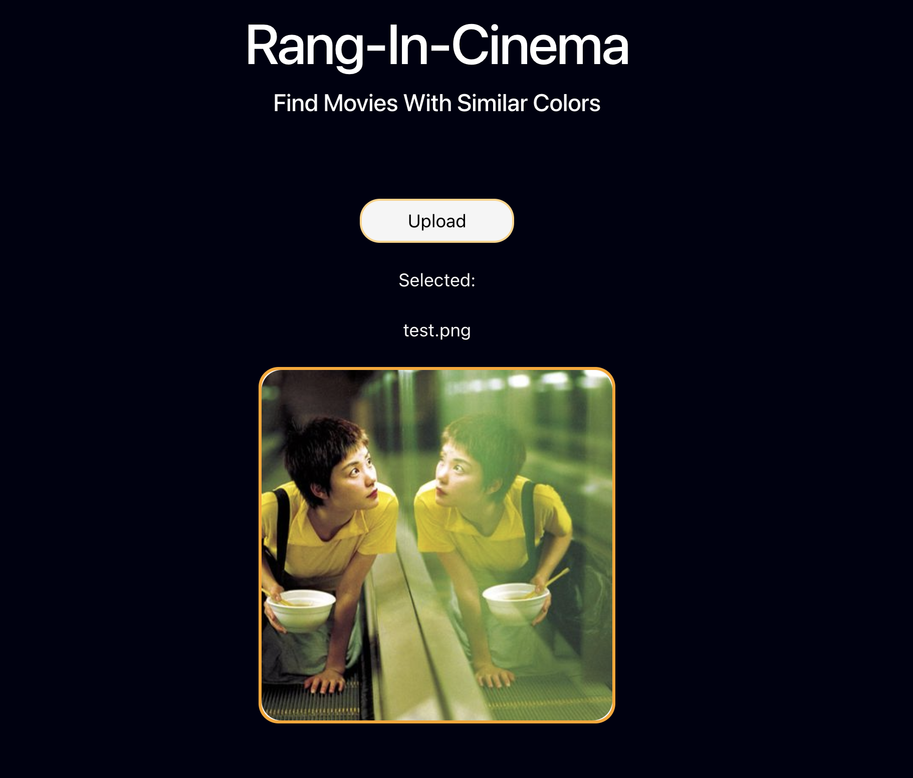
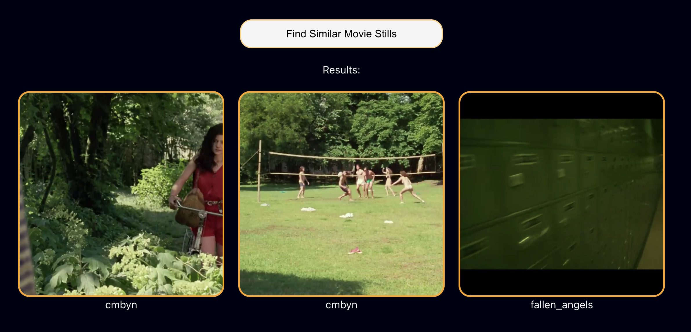

# Rang-In-Cinema
### रङ्गीन सिनेमा / रङ-इन-सिनेमा


A full-stack Computer Vision application that retrieves movie frames with similar color grading using handcrafted HSV histogram features. Users can upload an image and discover visually similar cinematic frames from a curated movie dataset.

The project demonstrates an end-to-end Machine Learning workflow—from feature extraction and similarity search to a deployed web application using FastAPI, React, Docker, Render, and Vercel.

---

## Live Demo

**Application**

https://rang-in-cinema.vercel.app/

> **Note:** The backend is hosted on Render's free tier. The first request after inactivity may take 30–60 seconds while the server wakes up.

---

## Screenshots

### Upload Image



### Search Results



---

## Motivation

Modern image retrieval systems often rely on deep learning embeddings. This project explores how far traditional computer vision techniques can go by using handcrafted color features instead.

Rather than using pretrained models, Rang-In-Cinema retrieves similar movie frames based solely on their color distributions. The project helped me better understand feature engineering, similarity search, full-stack ML development, containerization, and cloud deployment.

---

## Project Overview

Every film has its own visual identity created through color grading. This application compares the color distribution of an uploaded image with a database of extracted movie frames and returns the most visually similar results.

The complete pipeline consists of:

- Extract movie trailer frames
- Convert images to HSV color space
- Extract normalized hue histograms
- Store feature vectors
- Compare uploaded images against the feature database
- Rank frames by similarity
- Display the Top 3 matches

---

## System Architecture

```text
               Upload Image
                    │
                    ▼
            React Frontend
                    │
             HTTP POST Request
                    │
                    ▼
            FastAPI Backend
                    │
        HSV Histogram Extraction
                    │
                    ▼
        Feature Database (.pkl)
                    │
     Histogram Correlation Search
                    │
                    ▼
      Top 3 Similar Movie Frames
```

---

## Features

- Image-based movie frame retrieval
- HSV histogram feature extraction
- OpenCV histogram similarity search
- FastAPI REST API
- React + Vite frontend
- Image upload interface
- Dockerized frontend and backend
- Docker Compose support
- Render backend deployment
- Vercel frontend deployment
- Modular project architecture

---

## Project Structure

```text
rang-in-cinema/
│
├── backend/
│   ├── app/
│   │   ├── database.py
│   │   ├── image_utils.py
│   │   ├── main.py
│   │   └── search.py
│   ├── Dockerfile
│   └── requirements.txt
│
├── frontend/
│   ├── public/
│   ├── src/
│   │   ├── assets/
│   │   ├── components/
│   │   ├── App.jsx
│   │   ├── App.css
│   │   ├── index.css
│   │   └── main.jsx
│   ├── Dockerfile
│   ├── package.json
│   └── vite.config.js
│
├── dataset/
│   ├── features_db/
│   │   └── features.pkl
│   ├── frames/
│   ├── test/
│   └── trailers/
│
├── docs/
│   ├── image_upload.png
│   ├── results.png
│   ├── devlog.md
│   └── version1.md
│
├── scripts/
│   ├── extract_frames.py
│   └── feature_extractor.py
│
├── docker-compose.yaml
├── LICENSE
└── README.md
```

---

## Dataset

Frames were extracted from official movie trailers using OpenCV. I handpicked the movies myself, the selection factor being their own distinct visual identities.

Current dataset includes:

- Call Me By Your Name
- La La Land
- Blade Runner 2049
- Everything Everywhere All At Once
- Fallen Angels
- The Grand Budapest Hotel

Approximately **450 movie frames** were extracted at two-second intervals to build the retrieval database.

---

## Feature Extraction

Each frame is represented using handcrafted color features.

Pipeline:

- Read image
- Convert RGB to HSV
- Extract a 30-bin hue histogram
- Normalize histogram using L1 normalization
- Store feature vectors inside a serialized database

These features provide a compact representation of each frame's overall color palette.

---

## Image Retrieval Pipeline

For every uploaded image:

1. Read the query image
2. Convert it to HSV
3. Extract the hue histogram
4. Compare it with every stored feature vector
5. Compute histogram correlation
6. Rank all frames
7. Return the Top 3 most similar movie frames

Similarity metric:

- OpenCV Histogram Correlation

---

## Tech Stack

### Frontend

- React
- Vite
- JavaScript
- CSS

### Backend

- FastAPI
- Python
- OpenCV
- NumPy

### Deployment

- Docker
- Docker Compose
- Render
- Vercel

---

## API

### Search

```http
POST /search
```

Request:

```
multipart/form-data
```

Response:

```json
{
  "results": [
    {
      "Movie": "La La Land",
      "Frame": "dataset/frames/lalaland/lalaland_001.jpg",
      "correlation": 0.98
    }
  ]
}
```

---

## Running Locally

Clone the repository

```bash
git clone https://github.com/amisharn/rang-in-cinema.git
```

Move into the project

```bash
cd rang-in-cinema
```

Build and start the application

```bash
docker compose up --build
```

Or run each service manually.

### Backend

```bash
cd backend

pip install -r requirements.txt

uvicorn app.main:app --reload
```

### Frontend

```bash
cd frontend

npm install

npm run dev
```

---

## Deployment

Frontend:

- Vercel

Backend:

- Render

Containerization:

- Docker
- Docker Compose

---

## Future Improvements

- CLIP-based image embeddings
- FAISS vector search
- Larger movie dataset
- Texture and semantic feature extraction
- Scene-level retrieval
- User collections and favorites
- Improved UI/UX
- Mobile responsiveness
- Performance optimization

---

## What I Learned

This project helped me gain practical experience with:

- Computer Vision fundamentals
- HSV color space
- Feature engineering
- Image similarity search
- FastAPI backend development
- React frontend development
- REST APIs
- Docker and Docker Compose
- Cloud deployment
- Building an end-to-end Machine Learning application

---

## Author

**Amisha Raj Niroula**

Final Year BSc. CSIT Student

Interested in AI/ML, Computer Vision, and Full-Stack Development.

GitHub: https://github.com/amisharn

---

## License

This project is licensed under the MIT License.
